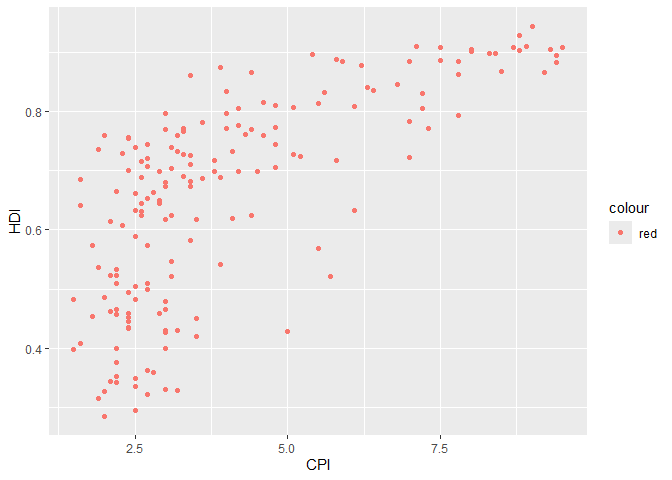
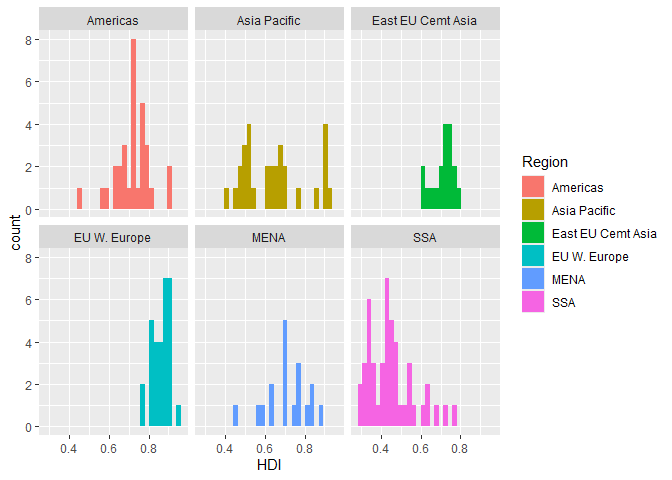

# Assignment 4: Data Transformation and Visualization_ONEIL


# Assignment 4: Data transformation and visualization

## Instructions: Please read through this before you begin

- This assignment is due by **10pm** on **Thursday 09/25/2025.**

- For this assignment, please **reproduce this markdown file exactly as
  shown** using Quarto (including this list of instructions). You do
  **NOT** need to fill out the code chunks (i.e. answer the questions)
  for this assignment. We are just practicing markdown formatting right
  now.

- Please name your Quarto file `assignment_4.qmd`

- Set the output format to `gfm` to produce the correct `.md` file for
  github rendering.

- Pay attention to all the formatting in this file, including bullet
  points, bold characters, inserted code chunks, headings, text colors,
  blank lines, and etc. You will need to reproduce all of these.

- You will use the product of this assignment as a template for your
  fourth assignment, where you will actually fill out the code chunks.

- You will have to submit your assignment through GitHub. You can
  complete your template after Thursday’s class, but don’t worry about
  submitting it until after we have gone over how to submit it through
  GitHub in next Tuesday’s class. To do so, you will first move
  `assignment_1.qmd` and `assignment.md` to the `problem_sets` folder in
  your own GitHub repository that you have created in class through
  GitHub Classroom. (If you haven’t created this repo yet, please use
  the following url:  <https://classroom.github.com/a/StaRJQLV>). Then,
  you can stage these files, make a commit, and push the commit.

  ## Load Packages

  To start load all the required packages with the following
  code.Install them if they are not installed yet.

  ``` r
  library(tidyverse)
  library(knitr)
  ```

## Exercise 1. Corruption and human development

This exercise explores a dataset containing the human development index
(`HD1`) and corruption perception index (`CPI`) of 173 countries across
6 different regions around the world: Americas, Asia Pacific, Eastern
Europe and Central Asia ( `East EU Cemt`), Western Europe
(`EU W. Europe`), Middle and North Africa (`MENA`), and Sub-Saharan
Africa (`SSA`). (Note: the larger `CPI` is, the less corrupted the
country is perceived to be.)

First, we load the data using the following code:

``` r
economist <- read.csv("https://raw.githubusercontent.com/nt246/NTRES-6100-data-science/master/datasets/EconomistData.csv")
```

#### 1.1 Show the first few rows of `economist_data`.

``` r
kable(economist)
```

|   X | Country                          | HDI.Rank |   HDI | CPI | Region            |
|----:|:---------------------------------|---------:|------:|----:|:------------------|
|   1 | Afghanistan                      |      172 | 0.398 | 1.5 | Asia Pacific      |
|   2 | Albania                          |       70 | 0.739 | 3.1 | East EU Cemt Asia |
|   3 | Algeria                          |       96 | 0.698 | 2.9 | MENA              |
|   4 | Angola                           |      148 | 0.486 | 2.0 | SSA               |
|   5 | Argentina                        |       45 | 0.797 | 3.0 | Americas          |
|   6 | Armenia                          |       86 | 0.716 | 2.6 | East EU Cemt Asia |
|   7 | Australia                        |        2 | 0.929 | 8.8 | Asia Pacific      |
|   8 | Austria                          |       19 | 0.885 | 7.8 | EU W. Europe      |
|   9 | Azerbaijan                       |       91 | 0.700 | 2.4 | East EU Cemt Asia |
|  10 | Bahamas                          |       53 | 0.771 | 7.3 | Americas          |
|  11 | Bahrain                          |       42 | 0.806 | 5.1 | MENA              |
|  12 | Bangladesh                       |      146 | 0.500 | 2.7 | Asia Pacific      |
|  13 | Barbados                         |       47 | 0.793 | 7.8 | Americas          |
|  14 | Belarus                          |       65 | 0.756 | 2.4 | East EU Cemt Asia |
|  15 | Belgium                          |       18 | 0.886 | 7.5 | EU W. Europe      |
|  16 | Benin                            |      167 | 0.427 | 3.0 | SSA               |
|  17 | Bhutan                           |      141 | 0.522 | 5.7 | Asia Pacific      |
|  18 | Bolivia                          |      108 | 0.663 | 2.8 | Americas          |
|  19 | Bosnia and Herzegovina           |       74 | 0.733 | 3.2 | East EU Cemt Asia |
|  20 | Botswana                         |      118 | 0.633 | 6.1 | SSA               |
|  21 | Brazil                           |       84 | 0.718 | 3.8 | Americas          |
|  22 | Britain                          |       28 | 0.863 | 7.8 | EU W. Europe      |
|  23 | Bulgaria                         |       55 | 0.771 | 3.3 | EU W. Europe      |
|  24 | Burkina Faso                     |      181 | 0.331 | 3.0 | SSA               |
|  25 | Burundi                          |      185 | 0.316 | 1.9 | SSA               |
|  26 | Cambodia                         |      139 | 0.523 | 2.1 | Asia Pacific      |
|  27 | Cameroon                         |      150 | 0.482 | 2.5 | SSA               |
|  28 | Canada                           |        6 | 0.908 | 8.7 | Americas          |
|  29 | Cape Verde                       |      133 | 0.568 | 5.5 | SSA               |
|  30 | Central African Republic         |      179 | 0.343 | 2.2 | SSA               |
|  31 | Chad                             |      183 | 0.328 | 2.0 | SSA               |
|  32 | Chile                            |       44 | 0.805 | 7.2 | Americas          |
|  33 | China                            |      101 | 0.687 | 3.6 | Asia Pacific      |
|  34 | Colombia                         |       87 | 0.710 | 3.4 | Americas          |
|  35 | Comoros                          |      163 | 0.433 | 2.4 | SSA               |
|  36 | Congo                            |      187 | 0.286 | 2.0 | SSA               |
|  37 | Congo Republic                   |      137 | 0.533 | 2.2 | SSA               |
|  38 | Costa Rica                       |       69 | 0.744 | 4.8 | Americas          |
|  39 | Côte d’Ivoire                    |      170 | 0.400 | 2.2 | SSA               |
|  40 | Croatia                          |       46 | 0.796 | 4.0 | East EU Cemt Asia |
|  41 | Cuba                             |       51 | 0.776 | 4.2 | Americas          |
|  42 | Cyprus                           |       31 | 0.840 | 6.3 | EU W. Europe      |
|  43 | Czech Republic                   |       27 | 0.865 | 4.4 | EU W. Europe      |
|  44 | Denmark                          |       16 | 0.895 | 9.4 | EU W. Europe      |
|  45 | Djibouti                         |      165 | 0.430 | 3.0 | SSA               |
|  46 | Dominica                         |       81 | 0.724 | 5.2 | Americas          |
|  47 | Dominican Republic               |       98 | 0.689 | 2.6 | Americas          |
|  48 | Ecuador                          |       83 | 0.720 | 2.7 | Americas          |
|  49 | Egypt                            |      113 | 0.644 | 2.9 | MENA              |
|  50 | El Salvador                      |      105 | 0.674 | 3.4 | Americas          |
|  51 | Equatorial Guinea                |      136 | 0.537 | 1.9 | SSA               |
|  52 | Eritrea                          |      177 | 0.349 | 2.5 | SSA               |
|  53 | Estonia                          |       34 | 0.835 | 6.4 | EU W. Europe      |
|  54 | Ethiopia                         |      174 | 0.363 | 2.7 | SSA               |
|  55 | Finland                          |       22 | 0.882 | 9.4 | EU W. Europe      |
|  56 | France                           |       20 | 0.884 | 7.0 | EU W. Europe      |
|  57 | Gabon                            |      106 | 0.674 | 3.0 | SSA               |
|  58 | Gambia                           |      168 | 0.420 | 3.5 | SSA               |
|  59 | Georgia                          |       75 | 0.733 | 4.1 | East EU Cemt Asia |
|  60 | Germany                          |        9 | 0.905 | 8.0 | EU W. Europe      |
|  61 | Ghana                            |      135 | 0.541 | 3.9 | SSA               |
|  62 | Greece                           |       29 | 0.861 | 3.4 | EU W. Europe      |
|  63 | Guatemala                        |      131 | 0.574 | 2.7 | Americas          |
|  64 | Guinea                           |      178 | 0.344 | 2.1 | SSA               |
|  65 | Guinea-Bissau                    |      176 | 0.353 | 2.2 | SSA               |
|  66 | Guyana                           |      117 | 0.633 | 2.5 | Americas          |
|  67 | Haiti                            |      158 | 0.454 | 1.8 | Americas          |
|  68 | Honduras                         |      121 | 0.625 | 2.6 | Americas          |
|  69 | Hong Kong                        |       13 | 0.898 | 8.4 | Asia Pacific      |
|  70 | Hungary                          |       38 | 0.816 | 4.6 | EU W. Europe      |
|  71 | Iceland                          |       14 | 0.898 | 8.3 | EU W. Europe      |
|  72 | India                            |      134 | 0.547 | 3.1 | Asia Pacific      |
|  73 | Indonesia                        |      124 | 0.617 | 3.0 | Asia Pacific      |
|  74 | Iran                             |       88 | 0.707 | 2.7 | MENA              |
|  75 | Iraq                             |      132 | 0.573 | 1.8 | MENA              |
|  76 | Ireland                          |        7 | 0.908 | 7.5 | EU W. Europe      |
|  77 | Israel                           |       17 | 0.888 | 5.8 | MENA              |
|  78 | Italy                            |       24 | 0.874 | 3.9 | EU W. Europe      |
|  79 | Jamaica                          |       79 | 0.727 | 3.3 | Americas          |
|  80 | Japan                            |       12 | 0.901 | 8.0 | Asia Pacific      |
|  81 | Jordan                           |       95 | 0.698 | 4.5 | MENA              |
|  82 | Kazakhstan                       |       68 | 0.745 | 2.7 | East EU Cemt Asia |
|  83 | Kenya                            |      143 | 0.509 | 2.2 | SSA               |
|  84 | Kiribati                         |      122 | 0.624 | 3.1 | Asia Pacific      |
|  85 | Korea (South)                    |       15 | 0.897 | 5.4 | Asia Pacific      |
|  86 | Kuwait                           |       63 | 0.760 | 4.6 | MENA              |
|  87 | Kyrgyzstan                       |      126 | 0.615 | 2.1 | East EU Cemt Asia |
|  88 | Laos                             |      138 | 0.524 | 2.2 | Asia Pacific      |
|  89 | Latvia                           |       43 | 0.805 | 4.2 | EU W. Europe      |
|  90 | Lebanon                          |       71 | 0.739 | 2.5 | MENA              |
|  91 | Lesotho                          |      160 | 0.450 | 3.5 | SSA               |
|  92 | Liberia                          |      182 | 0.329 | 3.2 | SSA               |
|  93 | Libya                            |       64 | 0.760 | 2.0 | MENA              |
|  94 | Lithuania                        |       40 | 0.810 | 4.8 | EU W. Europe      |
|  95 | Luxembourg                       |       25 | 0.867 | 8.5 | EU W. Europe      |
|  96 | Madagascar                       |      151 | 0.480 | 3.0 | SSA               |
|  97 | Malawi                           |      171 | 0.400 | 3.0 | SSA               |
|  98 | Malaysia                         |       61 | 0.761 | 4.3 | Asia Pacific      |
|  99 | Maldives                         |      109 | 0.661 | 2.5 | Asia Pacific      |
| 100 | Mali                             |      175 | 0.359 | 2.8 | SSA               |
| 101 | Malta                            |       36 | 0.832 | 5.6 | EU W. Europe      |
| 102 | Mauritania                       |      159 | 0.453 | 2.4 | SSA               |
| 103 | Mauritius                        |       77 | 0.728 | 5.1 | SSA               |
| 104 | Mexico                           |       57 | 0.770 | 3.0 | Americas          |
| 105 | Moldova                          |      111 | 0.649 | 2.9 | East EU Cemt Asia |
| 106 | Mongolia                         |      110 | 0.653 | 2.7 | Asia Pacific      |
| 107 | Montenegro                       |       54 | 0.771 | 4.0 | East EU Cemt Asia |
| 108 | Morocco                          |      130 | 0.582 | 3.4 | MENA              |
| 109 | Mozambique                       |      184 | 0.322 | 2.7 | SSA               |
| 110 | Myanmar                          |      149 | 0.483 | 1.5 | Asia Pacific      |
| 111 | Namibia                          |      120 | 0.625 | 4.4 | SSA               |
| 112 | Nepal                            |      157 | 0.458 | 2.2 | Asia Pacific      |
| 113 | Netherlands                      |        3 | 0.910 | 8.9 | EU W. Europe      |
| 114 | New Zealand                      |        5 | 0.908 | 9.5 | Asia Pacific      |
| 115 | Nicaragua                        |      129 | 0.589 | 2.5 | Americas          |
| 116 | Niger                            |      186 | 0.295 | 2.5 | SSA               |
| 117 | Nigeria                          |      156 | 0.459 | 2.4 | SSA               |
| 118 | Norway                           |        1 | 0.943 | 9.0 | EU W. Europe      |
| 119 | Oman                             |       89 | 0.705 | 4.8 | MENA              |
| 120 | Pakistan                         |      145 | 0.504 | 2.5 | Asia Pacific      |
| 121 | Panama                           |       58 | 0.768 | 3.3 | Americas          |
| 122 | Papua New Guinea                 |      153 | 0.466 | 2.2 | Asia Pacific      |
| 123 | Paraguay                         |      107 | 0.665 | 2.2 | Americas          |
| 124 | Peru                             |       80 | 0.725 | 3.4 | Americas          |
| 125 | Philippines                      |      112 | 0.644 | 2.6 | Asia Pacific      |
| 126 | Poland                           |       39 | 0.813 | 5.5 | EU W. Europe      |
| 127 | Portugal                         |       41 | 0.809 | 6.1 | EU W. Europe      |
| 128 | Qatar                            |       37 | 0.831 | 7.2 | MENA              |
| 129 | Romania                          |       50 | 0.781 | 3.6 | EU W. Europe      |
| 130 | Russia                           |       66 | 0.755 | 2.4 | East EU Cemt Asia |
| 131 | Rwanda                           |      166 | 0.429 | 5.0 | SSA               |
| 132 | Saint Lucia                      |       82 | 0.723 | 7.0 | Americas          |
| 133 | Saint Vincent and the Grenadines |       85 | 0.717 | 5.8 | Americas          |
| 134 | Samoa                            |       99 | 0.688 | 3.9 | Asia Pacific      |
| 135 | Saudi Arabia                     |       56 | 0.770 | 4.4 | MENA              |
| 136 | Senegal                          |      155 | 0.459 | 2.9 | SSA               |
| 137 | Serbia                           |       59 | 0.766 | 3.3 | East EU Cemt Asia |
| 138 | Seychelles                       |       52 | 0.773 | 4.8 | SSA               |
| 139 | Sierra Leone                     |      180 | 0.336 | 2.5 | SSA               |
| 140 | Singapore                        |       26 | 0.866 | 9.2 | Asia Pacific      |
| 141 | Slovakia                         |       35 | 0.834 | 4.0 | EU W. Europe      |
| 142 | Slovenia                         |       21 | 0.884 | 5.9 | EU W. Europe      |
| 143 | Solomon Islands                  |      142 | 0.510 | 2.7 | Asia Pacific      |
| 144 | South Africa                     |      123 | 0.619 | 4.1 | SSA               |
| 145 | Spain                            |       23 | 0.878 | 6.2 | EU W. Europe      |
| 146 | Sri Lanka                        |       97 | 0.691 | 3.3 | Asia Pacific      |
| 147 | Sudan                            |      169 | 0.408 | 1.6 | SSA               |
| 148 | Suriname                         |      104 | 0.680 | 3.0 | Americas          |
| 149 | Swaziland                        |      140 | 0.522 | 3.1 | SSA               |
| 150 | Sweden                           |       10 | 0.904 | 9.3 | EU W. Europe      |
| 151 | Switzerland                      |       11 | 0.903 | 8.8 | EU W. Europe      |
| 152 | Syria                            |      119 | 0.632 | 2.6 | MENA              |
| 153 | Tajikistan                       |      127 | 0.607 | 2.3 | East EU Cemt Asia |
| 154 | Tanzania                         |      152 | 0.466 | 3.0 | SSA               |
| 155 | Thailand                         |      103 | 0.682 | 3.4 | Asia Pacific      |
| 156 | Timor-Leste                      |      147 | 0.495 | 2.4 | Asia Pacific      |
| 157 | Togo                             |      162 | 0.435 | 2.4 | SSA               |
| 158 | Tonga                            |       90 | 0.704 | 3.1 | Asia Pacific      |
| 159 | Trinidad and Tobago              |       62 | 0.760 | 3.2 | Americas          |
| 160 | Tunisia                          |       94 | 0.698 | 3.8 | MENA              |
| 161 | Turkey                           |       92 | 0.699 | 4.2 | East EU Cemt Asia |
| 162 | Turkmenistan                     |      102 | 0.686 | 1.6 | East EU Cemt Asia |
| 163 | Uganda                           |      161 | 0.446 | 2.4 | SSA               |
| 164 | Ukraine                          |       76 | 0.729 | 2.3 | East EU Cemt Asia |
| 165 | United Arab Emirates             |       30 | 0.846 | 6.8 | MENA              |
| 166 | United States                    |        4 | 0.910 | 7.1 | Americas          |
| 167 | Uruguay                          |       48 | 0.783 | 7.0 | Americas          |
| 168 | Uzbekistan                       |      115 | 0.641 | 1.6 | East EU Cemt Asia |
| 169 | Vanuatu                          |      125 | 0.617 | 3.5 | Asia Pacific      |
| 170 | Venezuela                        |       73 | 0.735 | 1.9 | Americas          |
| 171 | Yemen                            |      154 | 0.462 | 2.1 | MENA              |
| 172 | Zambia                           |      164 | 0.430 | 3.2 | SSA               |
| 173 | Zimbabwe                         |      173 | 0.376 | 2.2 | SSA               |

#### 1.2 Explore the relationship between human development index (`HDI`) and the corruption perception index (`CPI`) with a scatter plot as the following.

``` r
economist |> 
  select(HDI, CPI) |> 
  ggplot()+
  geom_point(mapping = aes(x =CPI, y = HDI))
```


#### 1.3 Make the color of all points in the previous plot red.

``` r
economist |> 
  select(HDI, CPI) |> 
  ggplot()+
  geom_point(mapping = aes(x =CPI, y = HDI, color = "red"))
```



#### 1.4 Color the points in the previous plot according to the `Region` variable, and set the size of points to 2.

``` r
economist |> 
  select(HDI, CPI,Region ) |> 
  ggplot()+
  geom_point(mapping = aes(x =CPI, y = HDI, color = Region, size = 2))+
  guides (size = "none")
```


#### 1.5 Set the size of the points proportional to `HDI.Rank`

``` r
economist |> 
  select(HDI, CPI, Region, HDI.Rank ) |> 
  ggplot()+
  geom_point(mapping = aes(x =CPI, y = HDI, color = Region, size = HDI.Rank))
```


#### 1.6 Fit a smoothing line to all the data points in the scatter plot from Exercise 1.4

``` r
economist |> 
  select(HDI, CPI,Region, HDI.Rank ) |> 
  ggplot()+
  geom_point(mapping = aes(x =CPI, y = HDI, color = Region))+
  geom_smooth(mapping = aes(x= CPI, y= HDI))
```

    `geom_smooth()` using method = 'loess' and formula = 'y ~ x'


#### 1.7 Fit a separate **straight line** for **each region** instead, and turn off the confidence interval.

``` r
graph1_7 <- economist |> 
  select(HDI, CPI,Region, HDI.Rank ) |> 
  ggplot()+
  geom_point(mapping = aes(x =CPI, y = HDI, color = Region))+
  geom_smooth(mapping = aes(x= CPI, y= HDI, color = Region), method = "lm", se = F)
```

#### 1.8 Building on top of the previous plot, show each `Region` in a different facet.

``` r
graph1_7 + facet_wrap(~Region)
```

    `geom_smooth()` using formula = 'y ~ x'


#### 1.9 Show the distribution of `HDI` in each region using density plot. Set transparency to 0.5.

``` r
economist |> 
  select(HDI,Region) |> 
  ggplot()+
  geom_density(mapping = aes(x = HDI,fill=Region,alpha = 0.5))+
  guides(alpha = "none")
```


#### 1.10 Show the distribution of `HDI` in each region using histogram and facetting.

``` r
economist |> 
  select(HDI, Region) |> 
  ggplot()+
  geom_histogram(mapping = aes(x = HDI, fill = Region))+
  facet_wrap(~Region)
```

    `stat_bin()` using `bins = 30`. Pick better value with `binwidth`.



#### 1.11 Show the distribution of `HDI` in each region using a box plot. Set the transparency of these boxes to 0.5 and do not show outlier points with the box plot. Instead, show all data points for each country in the same plot (Hint: `geom_jitter()` or `position_jitter()` might be useful.)

``` r
economist |> 
  ggplot(data,mapping= aes(x = Region, y = HDI, fill = Region)) +
  geom_boxplot(alpha = 0.5, outlier.shape = NA) +  
  geom_jitter(aes(color = Region), width = 0.2, height = 0, size = 2) + 
  theme_minimal() +
  theme(legend.position = "right")
```


#### 1.12 Show the count of countries in each region using a bar plot.

``` r
economist |> 
  select(Region, Country) |>
  group_by(Country) |> 
  ggplot()+
  geom_bar(mapping = aes(x = Region))
```


#### 1.13 You have now created a variety of different plots of the same dataset. Which of your plots do you think are the most informative? Describe briefly the major trends that you see in the data.

Answer: The data shows that countries that have a higher HDI in most
cases have a higher CPI, which in this case is good, as a higher CPI
means the less corrupted the country is perceived to be. Western Europe
seems to have the highest HDI according to the data, with Sub-Saharan
Africa having the lowest HDI.

## Exercise 2. Theophylline experiment

This exercise uses the `Theoph` data frame (comes with your R
installation), which has 132 rows and 5 columns of data from an
experiment on the pharmacokinetics of the anti-asthmatic drug
theophylline. Twelve subjects were given oral doses of theophylline then
serum concentrations were measured at 11 time points over the next 25
hours. You can learn more about this dataset by running `?Theoph`

Have a look at the data structure

``` r
kable(head(Theoph))
```

| Subject |   Wt | Dose | Time |  conc |
|:--------|-----:|-----:|-----:|------:|
| 1       | 79.6 | 4.02 | 0.00 |  0.74 |
| 1       | 79.6 | 4.02 | 0.25 |  2.84 |
| 1       | 79.6 | 4.02 | 0.57 |  6.57 |
| 1       | 79.6 | 4.02 | 1.12 | 10.50 |
| 1       | 79.6 | 4.02 | 2.02 |  9.66 |
| 1       | 79.6 | 4.02 | 3.82 |  8.58 |

For the following exercise, **transform the data as instructed.** Try to
use `tidyverse` function even if you are more comfortable with base-R
solutions. Show the **first 6 lines** of the transformed data in a table
through RMArkdown **using the kable() function**, as shown above.

#### 2.1 Select columns that contain a lower case “t” in the `Theoph` dataset. Do not manually list all the columns to include.

``` r
Theoph |> 
  select(Subject,Wt) |> 
  head() |> 
  kable()
```

| Subject |   Wt |
|:--------|-----:|
| 1       | 79.6 |
| 1       | 79.6 |
| 1       | 79.6 |
| 1       | 79.6 |
| 1       | 79.6 |
| 1       | 79.6 |

#### 2.2 Rename the `Wt` column to `Weight` and `conc` column to `Concentration` in the `Theoph` dataset.

``` r
Theoph |> 
  select( Subject, Wt, Dose, Time,conc) |> 
  rename("Weight" = Wt) |> 
  rename("Concentration" = conc) |> 
  head() |> 
  kable()
```

| Subject | Weight | Dose | Time | Concentration |
|:--------|-------:|-----:|-----:|--------------:|
| 1       |   79.6 | 4.02 | 0.00 |          0.74 |
| 1       |   79.6 | 4.02 | 0.25 |          2.84 |
| 1       |   79.6 | 4.02 | 0.57 |          6.57 |
| 1       |   79.6 | 4.02 | 1.12 |         10.50 |
| 1       |   79.6 | 4.02 | 2.02 |          9.66 |
| 1       |   79.6 | 4.02 | 3.82 |          8.58 |

#### 2.3 Extract the `Dose` greater than 4.5 and `Time` greater than the mean `Time`.

``` r
Theoph |> 
  filter(Dose > 4.5) |> 
  filter(Time > mean(Time)) |> 
  head() |> 
  kable()
```

| Subject |   Wt | Dose |  Time | conc |
|:--------|-----:|-----:|------:|-----:|
| 3       | 70.5 | 4.53 |  7.07 | 5.30 |
| 3       | 70.5 | 4.53 |  9.00 | 4.90 |
| 3       | 70.5 | 4.53 | 12.15 | 3.70 |
| 3       | 70.5 | 4.53 | 24.17 | 1.05 |
| 5       | 54.6 | 5.86 |  7.02 | 7.09 |
| 5       | 54.6 | 5.86 |  9.10 | 5.90 |

#### 2.4 Sort the `Theoph` dataset by `Wt` from smallest to largest and secondarily by Time from largest to smallest.

``` r
Theoph |> 
  select(Wt, Dose, Time, conc) |> 
  arrange(desc(Time)) |> 
  arrange(Wt) |> 
  head() |> 
  kable()
```

|   Wt | Dose |  Time | conc |
|-----:|-----:|------:|-----:|
| 54.6 | 5.86 | 24.35 | 1.57 |
| 54.6 | 5.86 | 12.00 | 4.37 |
| 54.6 | 5.86 |  9.10 | 5.90 |
| 54.6 | 5.86 |  7.02 | 7.09 |
| 54.6 | 5.86 |  5.02 | 7.56 |
| 54.6 | 5.86 |  3.50 | 8.74 |

#### 2.5 Create a new column called `Quanity` that equal to `Wt` x `Dose` in the `Theoph` dataset. This will tell you the absolute quantity of drug administered to the subject (in mg). Replace the `Dose` variable with `Quanity`.

``` r
Theoph |>
  select(Wt, Dose, Time, conc) |> 
  mutate(Quantiy = Wt*Dose) |> 
  mutate(Dose = NULL) |> 
  select(Wt,Quantiy,Time, conc)|> 
  head() |> 
  kable()
```

|   Wt | Quantiy | Time |  conc |
|-----:|--------:|-----:|------:|
| 79.6 | 319.992 | 0.00 |  0.74 |
| 79.6 | 319.992 | 0.25 |  2.84 |
| 79.6 | 319.992 | 0.57 |  6.57 |
| 79.6 | 319.992 | 1.12 | 10.50 |
| 79.6 | 319.992 | 2.02 |  9.66 |
| 79.6 | 319.992 | 3.82 |  8.58 |

#### 2.6 Find the mean `conc` and sum of the `Dose` received by each test subject.

Show data for 6 subjects with the smallest sum of `Dose` as below. **Do
not define new intermediate objects for this exercise; use pipes to
chain together functions.**

``` r
  Theoph |> 
  group_by(Subject) %>%
  summarise(
    mean_conc = mean(conc, na.rm = TRUE),
    sum_dose = sum(Dose, na.rm = TRUE)
  ) %>%
  arrange(sum_dose) %>%
  slice_head(n = 6) |> 
    kable()
```

| Subject | mean_conc | sum_dose |
|:--------|----------:|---------:|
| 9       |  4.893636 |    34.10 |
| 6       |  3.525454 |    44.00 |
| 1       |  6.439091 |    44.22 |
| 2       |  4.823636 |    48.40 |
| 4       |  4.940000 |    48.40 |
| 8       |  4.271818 |    49.83 |

## Exercise 3. Unemployment in the US 1967-2015 (OPTIONAL)

This exercise uses the dataset `economics` from the ggplot2 package. It
was produced from US economic time series data available
<http://research.stlouisfed.org/fred2>. It describes the number of
unemployed persons (`unemploy`), among other variables, in the US from
1967 to 2015.

``` r
head(economics) %>% kable()
```

| date       |   pce |    pop | psavert | uempmed | unemploy |
|:-----------|------:|-------:|--------:|--------:|---------:|
| 1967-07-01 | 506.7 | 198712 |    12.6 |     4.5 |     2944 |
| 1967-08-01 | 509.8 | 198911 |    12.6 |     4.7 |     2945 |
| 1967-09-01 | 515.6 | 199113 |    11.9 |     4.6 |     2958 |
| 1967-10-01 | 512.2 | 199311 |    12.9 |     4.9 |     3143 |
| 1967-11-01 | 517.4 | 199498 |    12.8 |     4.7 |     3066 |
| 1967-12-01 | 525.1 | 199657 |    11.8 |     4.8 |     3018 |

#### 3.1 Plot the trend in number of unemployed person (`unemploy`) though time using the economics dataset shown above. And this question only, hide your code and only show the plot.

``` r
## Write your code here
```

#### 3.2 Edit the plot title and axis labels of the previous plot appropriately. Make y axis start from 0. Change the background them to what is shown below. (Hint: search for help online if needed.)

``` r
## Write your code here
```
