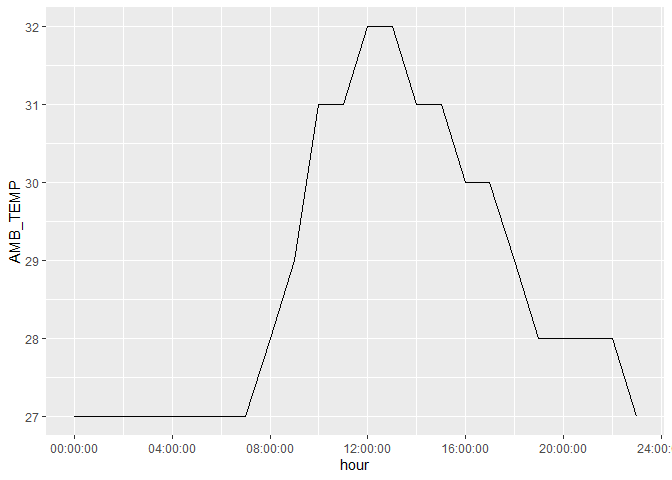
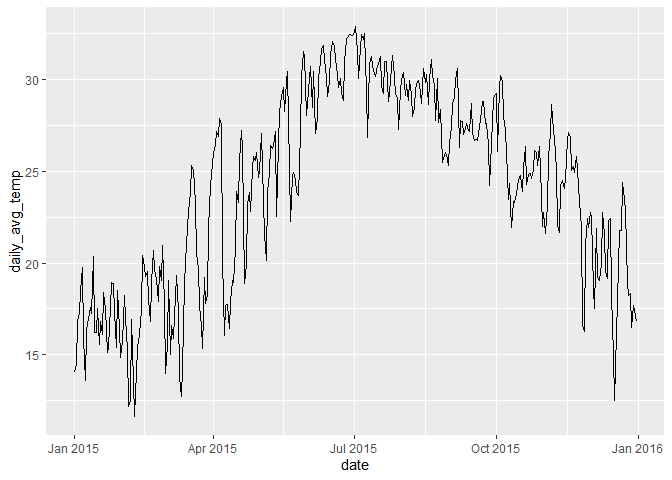
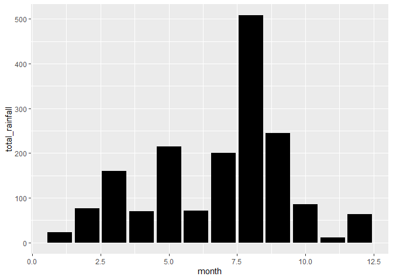
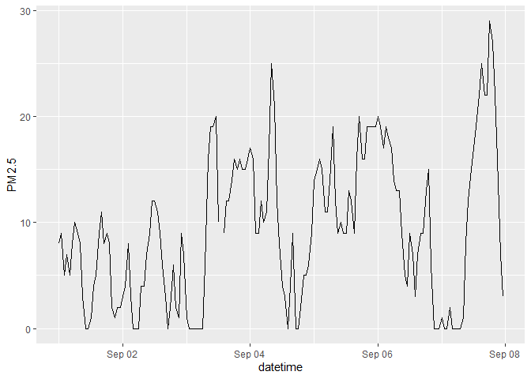

# assignment_6_ONEIL


# Assignment 6: Data import and tidy data

``` r
library(tidyverse)
library(knitr)
library(lubridate)
```

## Exercise 1. Tibble and Data Import

Import the data frames listed below into R and
[parse](https://r4ds.had.co.nz/data-import.html#parsing-a-vector) the
columns appropriately when needed. Watch out for the formatting oddities
of each dataset. Print the results directly, **without** using
`kable()`.

**You only need to finish any three out of the five questions in this
exercise in order to get credit.**

#### 1.1 Create the following tibble manually, first using `tribble()` and then using `tibble()`. Print both results. \[We didn’t have time to cover this in class, but look up how these functions work [here](https://r4ds.had.co.nz/tibbles.html#creating-tibbles)\]

`tibble():`

``` r
tibble(a = c(1,2),b= c(2.1, 3.2),c= c("apple", "orange")) |> 
  print()
```

    # A tibble: 2 × 3
          a     b c     
      <dbl> <dbl> <chr> 
    1     1   2.1 apple 
    2     2   3.2 orange

`tribble():`

``` r
tribble(
  ~a, ~b, ~c,
  1, 2.1, "apple",
  2, 3.2, "orange"
) |> 
  print()
```

    # A tibble: 2 × 3
          a     b c     
      <dbl> <dbl> <chr> 
    1     1   2.1 apple 
    2     2   3.2 orange

#### 1.2 Import `https://raw.githubusercontent.com/nt246/NTRES-6100-data-science/master/datasets/dataset2.txt` into R. Change the column names into “Name”, “Weight”, “Price”.

``` r
fruit<- read.csv("https://raw.githubusercontent.com/nt246/NTRES-6100-data-science/master/datasets/dataset2.txt", header = FALSE)

colnames(fruit)<- c("Name", "Weight", "Price")

tibble(fruit)
```

    # A tibble: 3 × 3
      Name   Weight Price
      <chr>   <int> <dbl>
    1 apple       1   2.9
    2 orange      2   4.9
    3 durian     10  19.9

#### 1.3 Import `https://raw.githubusercontent.com/nt246/NTRES-6100-data-science/master/datasets/dataset3.txt` into R. Watch out for the first few lines, missing values, separators, quotation marks, and deliminaters.

``` r
fruit_1.3 <-read_delim("https://raw.githubusercontent.com/nt246/NTRES-6100-data-science/master/datasets/dataset3.txt", quote ="/", skip = 2, na = c("Not Available", "?"))
 tibble(fruit_1.3)
```

    # A tibble: 3 × 3
      Name   Weight Price
      <chr>   <dbl> <dbl>
    1 apple       1   2.9
    2 orange      2  NA  
    3 durian     NA  19.9

## Exercise 2. Weather station

This dataset contains the weather and air quality data collected by a
weather station in Taiwan. It was obtained from the Environmental
Protection Administration, Executive Yuan, R.O.C. (Taiwan).

#### 2.1 Variable descriptions

- The text file
  `https://raw.githubusercontent.com/nt246/NTRES-6100-data-science/master/datasets/2015y_Weather_Station_notes.txt`
  contains descriptions of different variables collected by the station.

- Import it into R and print it in a table as shown below with
  `kable()`.

``` r
weather_station <- read.delim("https://raw.githubusercontent.com/nt246/NTRES-6100-data-science/master/datasets/2015y_Weather_Station_notes.txt", header = TRUE, sep = "-", dec = ".")

kable(weather_station)
```

| Item | Unit | Description |
|:---|:---|:---|
| AMB_TEMP | Celsius | Ambient air temperature |
| CO | ppm | Carbon monoxide |
| NO | ppb | Nitric oxide |
| NO2 | ppb | Nitrogen dioxide |
| NOx | ppb | Nitrogen oxides |
| O3 | ppb | Ozone |
| PM10 | μg/m3 | Particulate matter with a diameter between 2.5 and 10 μm |
| PM2.5 | μg/m3 | Particulate matter with a diameter of 2.5 μm or less |
| RAINFALL | mm | Rainfall |
| RH | % | Relative humidity |
| SO2 | ppb | Sulfur dioxide |
| WD_HR | degress | Wind direction (The average of hour) |
| WIND_DIREC | degress | Wind direction (The average of last ten minutes per hour) |
| WIND_SPEED | m/sec | Wind speed (The average of last ten minutes per hour) |
| WS_HR | m/sec | Wind speed (The average of hour) |

`#` indicates invalid value by equipment inspection  
`*` indicates invalid value by program inspection  
`x` indicates invalid value by human inspection  
`NR` indicates no rainfall  
blank indicates no data

#### 2.2 Data tidying

- Import
  `https://raw.githubusercontent.com/nt246/NTRES-6100-data-science/master/datasets/2015y_Weather_Station.csv`
  into R. As you can see, this dataset is a classic example of untidy
  data: values of a variable (i.e. hour of the day) are stored as column
  names; variable names are stored in the `item` column.

- Clean this dataset up and restructure it into a tidy format.

- Parse the `date` variable into date format and parse `hour` into time.

- Turn all invalid values into `NA` and turn `NR` in rainfall into `0`.

- Parse all values into numbers.

- Show the first 6 rows and 10 columns of this cleaned dataset, as shown
  below, *without* using `kable()`.

*Hints: you don’t have to perform these tasks in the given order; also,
warning messages are not necessarily signs of trouble.*

``` r
weather_2.2 <- read.csv("https://raw.githubusercontent.com/nt246/NTRES-6100-data-science/master/datasets/2015y_Weather_Station.csv")
```

Before cleaning:

``` r
tibble(weather_2.2[1:6, 1:10])
```

    # A tibble: 6 × 10
      date       station item     X00   X01   X02   X03   X04   X05   X06  
      <chr>      <chr>   <chr>    <chr> <chr> <chr> <chr> <chr> <chr> <chr>
    1 2015/01/01 Cailiao AMB_TEMP 16    16    15    15    15    14    14   
    2 2015/01/01 Cailiao CO       0.74  0.7   0.66  0.61  0.51  0.51  0.51 
    3 2015/01/01 Cailiao NO       1     0.8   1.1   1.7   2     1.7   1.9  
    4 2015/01/01 Cailiao NO2      15    13    13    12    11    13    13   
    5 2015/01/01 Cailiao NOx      16    14    14    13    13    15    15   
    6 2015/01/01 Cailiao O3       35    36    35    34    34    32    30   

After cleaning:

``` r
weather_raw <- read_csv("https://raw.githubusercontent.com/nt246/NTRES-6100-data-science/master/datasets/2015y_Weather_Station.csv", col_names = (TRUE), guess_max = Inf)


weather_clean <- weather_raw |>
  pivot_longer(cols = c("00":"23"), names_to = "hour", values_to = "value") |>
  pivot_wider(names_from = item, values_from = value) |>
  mutate(date = as.Date(date), across(AMB_TEMP:PM10, as.numeric), hour = hms::as_hms(paste0(hour, ":00:00")))


weather_clean <- weather_clean |>
  mutate(RAINFALL = ifelse(RAINFALL == "NR", 0, RAINFALL)) |>
  mutate(across(AMB_TEMP:PM10, ~na_if(.x, -99.99))) |>
  mutate(across(AMB_TEMP:PM10, as.numeric))

tibble(weather_clean[1:6, 1:10])
```

    # A tibble: 6 × 10
      date       station hour   AMB_TEMP    CO    NO   NO2   NOx    O3  PM10
      <date>     <chr>   <time>    <dbl> <dbl> <dbl> <dbl> <dbl> <dbl> <dbl>
    1 2015-01-01 Cailiao 00:00        16  0.74   1      15    16    35   171
    2 2015-01-01 Cailiao 01:00        16  0.7    0.8    13    14    36   174
    3 2015-01-01 Cailiao 02:00        15  0.66   1.1    13    14    35   160
    4 2015-01-01 Cailiao 03:00        15  0.61   1.7    12    13    34   142
    5 2015-01-01 Cailiao 04:00        15  0.51   2      11    13    34   123
    6 2015-01-01 Cailiao 05:00        14  0.51   1.7    13    15    32   110

#### 2.3 Using this cleaned dataset, plot the daily variation in ambient temperature on September 25, 2015, as shown below.

``` r
weather_clean |>
  filter(date == "2015/09/15") |>
  ggplot()+
  geom_line(aes(x = hour, y = AMB_TEMP, group = station))
```



#### 2.4 Plot the daily average ambient temperature throughout the year with a **continuous line**, as shown below.

``` r
weather_clean |> 
  group_by(date) |> 
  summarise(daily_avg_temp = mean(AMB_TEMP, na.rm = TRUE)) |> 
  ggplot(aes(x = date, y = daily_avg_temp)) +
  geom_line()
```



#### 2.5 Plot the total rainfall per month in a bar chart, as shown below.

*Hint: separating date into three columns might be helpful.*

``` r
weather_clean <- weather_clean |>
  mutate(month = month(date), year = year(date))


weather_clean |> 
  group_by(month) |> 
  mutate(RAINFALL = as.numeric(RAINFALL)) |> 
  summarise(total_rainfall = sum(RAINFALL, na.rm = TRUE)) |> 
  ggplot(aes(x = month, y = total_rainfall)) +
  geom_bar(stat = "identity", fill = "black")
```



#### 2.6 Plot the per hour variation in PM2.5 in the first week of September with a **continuous line**, as shown below.

*Hint: uniting the date and hour and parsing the new variable might be
helpful*

``` r
weather_clean$month <- as.character(weather_clean$month)
weather_clean |> 
  mutate(PM2.5 = as.numeric(PM2.5)) |> 
  mutate(day = day(date), month = month(date), year = year(date)) |> 
  mutate(datetime = as.POSIXct(paste(date, hour), format="%Y-%m-%d %H:%M:%S")) |> 
  filter(month == 9) |> 
  filter(between(day, 1, 7)) |> 
  ggplot()+
  geom_line(aes(x = datetime, y = PM2.5))
```


